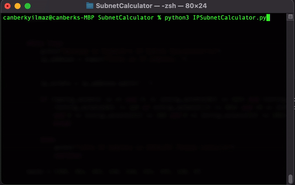

# IP Subnetting

Basic Python application that takes an IP Address and its subnet mask, given via user input, and displays its corresponding Network address, Broadcast address, Number of valid hosts, Wildcard mask, and CIDR Mask bits.

Additionally, the app is capable of generating random IP addresses for hosts available within the subnet.

***App Demo***

